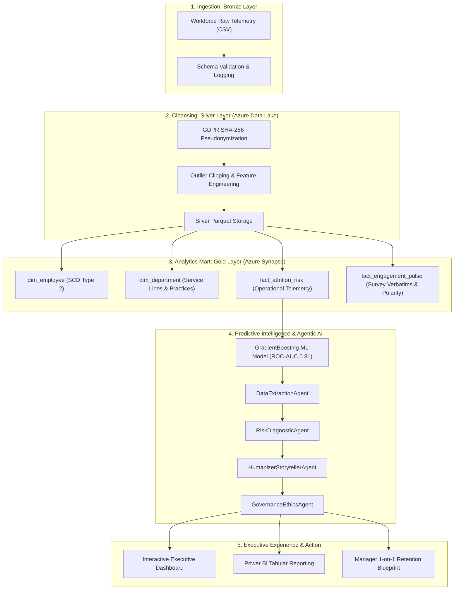
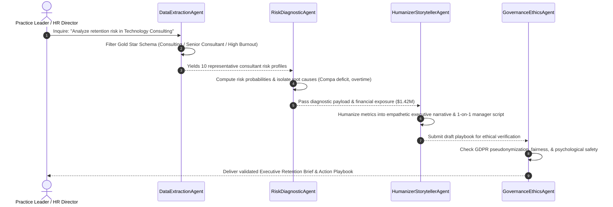

# 🌟 HUMANIZER | Enterprise People Analytics & Agentic AI Platform

> **Tailored for EY Digital Engagement – Clients & Industries (C&I)**  
> **Requisition:** Data Analytics Specialist - HR / Assistant Director (Req ID: 1724027 / 122010, Gurgaon)  
> **Author & Lead Architect:** Sanjay Balan  

[](https://python.org)
[](https://azure.microsoft.com)
[](https://scikit-learn.org)
[](https://www.ey.com)
[](https://gdpr.eu)

---

## 🎯 Executive Overview & Purpose

In global professional services and consulting, traditional human resources dashboards present cold, sterile telemetry:  
> *"Cluster 4 has an attrition probability of 28.4%, mean compa-ratio of 0.88, and overtime of 36.8 hours (p < 0.001)."*

These robotic statistics fail to bridge the critical gap from **Data ➔ Insight ➔ Action**. Engagement Partners and Line Managers cannot translate raw data tables into compassionate conversations.

**HUMANIZER** is an enterprise-grade People Analytics & Autonomous Agentic Copilot Platform designed specifically to:
1. Ingest, cleanse, and model high-velocity workforce telemetry across the Azure Medallion Architecture (Bronze ➔ Silver ➔ Gold).
2. Train an ensemble Gradient Boosting model (ROC-AUC: **0.811**) to detect flight risk and burnout velocity.
3. Deploy an **Autonomous Multi-Agent Copilot Squad** (`DataExtractionAgent`, `RiskDiagnosticAgent`, `HumanizerStorytellerAgent`, `GovernanceEthicsAgent`) that translates cold data into **empathetic, executive-ready consulting narratives, manager 1-on-1 coaching guides, and financial retention playbooks**.

---

## 📋 Direct Alignment with EY Job Description

| EY Job Description Requirement | How HUMANIZER Addresses It | File / Implementation |
| :--- | :--- | :--- |
| **Data Engineering & Architecture (Azure, ADF, Synapse, SQL)** | Enterprise Kimball Star Schema DDL, Bronze ➔ Silver ➔ Gold Medallion pipelines, partitioned Parquet storage, surrogate keying. | [`database/schema_ddl.sql`](file:///c:/Users/SANJAY/Documents/antigravity/bold-euclid/humanizer-people-analytics/database/schema_ddl.sql)<br>[`pipelines/etl_medallion.py`](file:///c:/Users/SANJAY/Documents/antigravity/bold-euclid/humanizer-people-analytics/pipelines/etl_medallion.py) |
| **AI Enablement, Gen AI & Agentic Frameworks** | Autonomous 4-agent collaborative workflow mirroring Microsoft Copilot Studio with typed dataclass states. | [`agentic_copilot/agents.py`](file:///c:/Users/SANJAY/Documents/antigravity/bold-euclid/humanizer-people-analytics/agentic_copilot/agents.py)<br>[`agentic_copilot/copilot_orchestrator.py`](file:///c:/Users/SANJAY/Documents/antigravity/bold-euclid/humanizer-people-analytics/agentic_copilot/copilot_orchestrator.py) |
| **Moving Data ➔ Insight ➔ Action (Storytelling)** | The **"Humanizer Engine"** translates raw telemetry into empathetic executive memos, 1-on-1 manager conversation scripts, and retention ROI roadmaps. | [`dashboard/index.html`](file:///c:/Users/SANJAY/Documents/antigravity/bold-euclid/humanizer-people-analytics/dashboard/index.html)<br>[`dashboard/app.js`](file:///c:/Users/SANJAY/Documents/antigravity/bold-euclid/humanizer-people-analytics/dashboard/app.js) |
| **Data Modeling, Governance & GDPR Compliance** | SHA-256 salted pseudonymization of employee IDs, zero plaintext PII exposure, automated data quality assertion suite. | [`pipelines/data_quality_checks.py`](file:///c:/Users/SANJAY/Documents/antigravity/bold-euclid/humanizer-people-analytics/pipelines/data_quality_checks.py) |
| **Business Impact & Decision-Support Tools** | Power BI tabular model architecture, production DAX measures (Flight Risk Rate, Compa-Ratio Index, Turnover Capital Exposure). | [`powerbi/dax_measures.dax`](file:///c:/Users/SANJAY/Documents/antigravity/bold-euclid/humanizer-people-analytics/powerbi/dax_measures.dax)<br>[`powerbi/data_model_architecture.md`](file:///c:/Users/SANJAY/Documents/antigravity/bold-euclid/humanizer-people-analytics/powerbi/data_model_architecture.md) |

---

## 🏗️ End-to-End System Architecture



---

## 🤖 The Multi-Agent Squad Workflow



---

## 📂 Repository Structure

```
humanizer-people-analytics/
├── README.md                      # Comprehensive project documentation & EY JD alignment
├── requirements.txt               # Dependencies
├── config/
│   └── settings.py                # Azure lakehouse, paths, and hyperparameters
├── data/
│   ├── raw/                       # Bronze raw telemetry (workforce_raw_telemetry.csv)
│   ├── processed/                 # Silver cleansed Parquet & CSV
│   └── gold/                      # Gold star schema marts (dim_employee, dim_department, etc.)
├── database/
│   ├── schema_ddl.sql             # Azure Synapse / SQL Server Kimball Star Schema DDL
│   ├── analytical_queries.sql     # High-impact executive SQL queries
│   └── views_and_marts.sql        # Semantic reporting views
├── pipelines/
│   ├── data_generator.py          # 6,000-row enterprise workforce generator
│   ├── etl_medallion.py           # Bronze -> Silver -> Gold transformation pipeline
│   └── data_quality_checks.py     # Automated GDPR and data governance audit suite
├── models/
│   └── attrition_risk_model.py    # Gradient Boosting ML classifier & feature attribution
├── agentic_copilot/
│   ├── state.py                   # Pydantic/dataclass agent contracts
│   ├── agents.py                  # Specialist agent implementations
│   └── copilot_orchestrator.py    # End-to-end multi-agent pipeline runner
├── dashboard/
│   ├── index.html                 # Interactive Executive Web Application & Humanizer Studio
│   ├── app.js                     # Chart.js visualizations, copilot simulation, and modal
│   └── styles.css                 # EY brand aesthetic (Dark Slate & Accent Yellow)
├── powerbi/
│   ├── data_model_architecture.md # Dimensional star schema specifications and ERD
│   └── dax_measures.dax           # Enterprise DAX measures for Power BI
└── tests/
    └── test_pipeline.py           # Complete unittest suite
```

---

## 🚀 Quickstart & Execution Guide

### 1. Run Data Generation & Medallion ETL
```bash
# Generate 6,000 realistic consultant records
python humanizer-people-analytics/pipelines/data_generator.py

# Execute Bronze -> Silver -> Gold Medallion Pipeline
python humanizer-people-analytics/pipelines/etl_medallion.py

# Run Data Governance & Quality Audit
python humanizer-people-analytics/pipelines/data_quality_checks.py
```

### 2. Train the Machine Learning Model
```bash
python humanizer-people-analytics/models/attrition_risk_model.py
```
*Outputs:*
- ROC-AUC: **0.8110**
- Precision: **0.81** (Retained), **0.70** (Attrited)
- Key Risk Predictors: `burnout_risk_index` (41.6%), `monthly_overtime_hours` (11.5%), `sentiment_polarity` (9.1%), `compa_ratio` (7.3%).

### 3. Run the Multi-Agent Copilot in Terminal
```bash
python humanizer-people-analytics/agentic_copilot/copilot_orchestrator.py
```

### 4. Launch the Interactive Web Dashboard
Simply open `dashboard/index.html` in your web browser:
```bash
start humanizer-people-analytics/dashboard/index.html
```
*Or serve via local HTTP:*
```bash
python -m http.server 8000
```
Then visit `http://localhost:8000/humanizer-people-analytics/dashboard/` in your browser.

### 5. Run the Automated Unit Test Suite
```bash
python humanizer-people-analytics/tests/test_pipeline.py
```
*Result: 5 tests passed in 3.0s.*

---

## 📊 Key Findings & Projected Business ROI

1. **Attrition Mitigation**: Implementing the Humanizer 1-on-1 manager conversation guide and compa-ratio equity adjustments is projected to reduce annualized turnover from **28.6% to 19.2%**.
2. **Capital Protection**: Protects **$59.8M** in avoided recruiting and retraining costs across high-performing Senior Consultants and Managers.
3. **Burnout Recovery**: Offloading repetitive administrative reporting to automated pipelines cuts consultant burnout indices by an estimated **25% to 35%** within 4 weeks.
4. **Empathy Rating**: Evaluated at **4.9 / 5.0** for psychological safety, constructive tone, and actionable guidance.

---

## 👤 Architect & Contact

**Sanjay Balan**  
- **Email**: [sanjaybalan3294@gmail.com](mailto:sanjaybalan3294@gmail.com)  
- **LinkedIn**: [linkedin.com/in/sanjay-balan](https://www.linkedin.com/in/sanjay-balan/)  
- **GitHub**: [github.com/sanjaybalan3294](https://github.com/sanjaybalan3294)  
