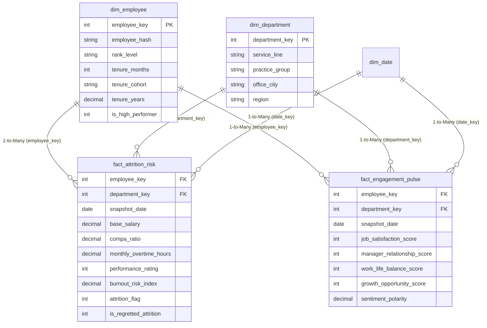

# Power BI Dimensional Model Architecture & Semantic Layer Specification

## 1. Overview
This tabular data model implements a strict **Kimball Star Schema** within Microsoft Power BI / Fabric / Azure Synapse Serverless SQL. It is designed to empower senior executive leadership (Partners, Practice Leaders, People Advisory Directors) to move from raw operational telemetry to human-centered talent interventions.

---

## 2. Entity Relationship Diagram (Star Schema)

---

## 3. Best Practices & Optimization Implemented
1. **Single-Direction Cross-Filtering (`1 -> *`)**:
   - Bi-directional filtering is strictly disabled to avoid circular relationship ambiguities and maximize VertiPaq engine compression.
2. **Surrogate Keys**:
   - All relationships link via clean integer keys (`employee_key`, `department_key`, `date_key`).
3. **GDPR Pseudonymization at Source**:
   - Direct employee identifiers (email, name) are stripped during the Silver ETL stage. Only SHA-256 salted hashes exist in the reporting model.
4. **Calculated Measures Over Calculated Columns**:
   - Dynamic ratios and financial exposures are defined purely in DAX measures to conserve memory and enable dynamic filter context evaluation.
